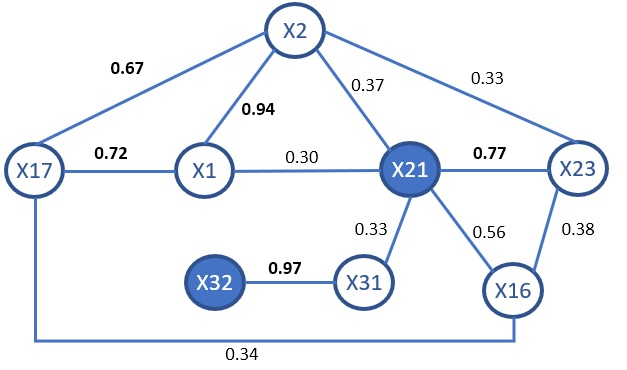

```{r setup, include=FALSE, cache=TRUE}
knitr::opts_chunk$set(echo = TRUE, cache=TRUE, warning=FALSE, message=FALSE)
library(caret);library(car);library(e1071);library(questionr);library(stats);library(glmnet);library(Matrix);
library(foreach);library(MASS);library(tidyr);library(pROC);library(olsrr);library(corrplot);library(dummies)
library(dplyr);library(ggplot2);library(kableExtra);library(GGally);library(mctest)
library(outliers); library(igraph);library(randomForest);library(rpart);library(BMA)
#setwd("C:/trabajo/2018-2019/Eafit/2do_sem/Metodos_Avanzados/Competencia")
setwd("C://Users/Julian Castelblanco/Desktop/Met/Competencia_Com/Binario/")
```
# Introducción

A partir de la base de datos suministrada, que tiene las siguientes variables: <br>
<ul>
<li>yl: Variable binaria dependiente</li>
<li>xl a X32: Variables independientes</li>
</ul>
<br>
Se procederá a construir uno modelo de prediccción, que responda a los requierimientos propuestos en la competencia, que tiene tres criterios de evaluación:<br>
<ul>
<li>Capacidad predictiva específica  : 15%</li>
<li>Capacidad predictiva general     : 25%</li>
<li>Selección de regresores          : 25%</li>
</ul>

Teniendo en cuenta que para determinar la capacidad predictiva general será la:
Presición-*Accuracy*=$\frac{Verdaderos positivos-TP + verdaderos Negativos-TN}{Tamaño de la muestra (n)}$ .

# 1. Carga de Datos y Análisis Descriptivo 

```{r loading_data, cache=TRUE}
dtOriginal <-read.csv("C://Users/Julian Castelblanco/Desktop/Met/Competencia_Com/Binario/databinarystudents.csv", header = TRUE, sep="," , na.strings = c("", "NA"), encoding = "UTF-8", stringsAsFactors=FALSE)
dtOriginal <- dtOriginal %>% na.omit()
#dtOriginal$yL <-as.factor(dtOriginal$yL)
#summary(dtOriginal)
dtDatBinaria <- dtOriginal[2:34]
#str(dtDatBinaria)
summary(dtDatBinaria)
```
Al subir los datos se eliminan los registros sin datos y la variable con el identificador de cada registro. En una inspección visual de los datos se identifican varias variables que son del tipo categóricas, sin embargo, por el momento no se va a realizar ninguna operación u transformación sobre las variables, para mantener la condición inicial y realizar una análisis preliminar de los datos. 

### 1.1 Frequencias Variables Categóricas
A continuación se presentan las tablas de frecuencias de las variables categóricas, en las que se puede apreciar que los datos están desbalanceados, por ejemplo las variables: x5, x6,x7,x14,x15,x16, x18, x19, x20, x28 y x29 tiene pocas observaciones con valor de 1, porque la mayoría de las observaciones tiene valor de 0.
<br>
```{r ploting_categoricals,cache=TRUE, warning=FALSE, echo=FALSE, message=FALSE, fig.width=1.5, fig.height=1.5}
par(mfrow=c(3,6))
ggplot(dtDatBinaria, aes(x=factor(yL))) + geom_bar(stat="count", fill="steelblue") + labs(title= "yL", y="", x="")
ggplot(dtDatBinaria, aes(x=factor(x3))) + geom_bar(stat="count", fill="steelblue") + labs(title= "x3", y="", x="")
ggplot(dtDatBinaria, aes(x=factor(x4))) + geom_bar(stat="count", fill="steelblue") + labs(title= "x4", y="", x="")
ggplot(dtDatBinaria, aes(x=factor(x5))) + geom_bar(stat="count", fill="steelblue") + labs(title= "x5", y="", x="")
ggplot(dtDatBinaria, aes(x=factor(x6))) + geom_bar(stat="count", fill="steelblue") + labs(title= "x6", y="", x="")
ggplot(dtDatBinaria, aes(x=factor(x7))) + geom_bar(stat="count", fill="steelblue") + labs(title= "x7", y="", x="")
ggplot(dtDatBinaria, aes(x=factor(x13))) + geom_bar(stat="count", fill="steelblue") + labs(title= "x13", y="", x="")
ggplot(dtDatBinaria, aes(x=factor(x14))) + geom_bar(stat="count", fill="steelblue") + labs(title= "x14", y="", x="")
ggplot(dtDatBinaria, aes(x=factor(x15))) + geom_bar(stat="count", fill="steelblue") + labs(title= "x15", y="", x="")
ggplot(dtDatBinaria, aes(x=factor(x16))) + geom_bar(stat="count", fill="steelblue") + labs(title= "x16", y="", x="")
ggplot(dtDatBinaria, aes(x=factor(x17))) + geom_bar(stat="count", fill="steelblue") + labs(title= "x17", y="", x="")
ggplot(dtDatBinaria, aes(x=factor(x18))) + geom_bar(stat="count", fill="steelblue") + labs(title= "x18", y="", x="")
ggplot(dtDatBinaria, aes(x=factor(x19))) + geom_bar(stat="count", fill="steelblue") + labs(title= "x19", y="", x="")
ggplot(dtDatBinaria, aes(x=factor(x20))) + geom_bar(stat="count", fill="steelblue") + labs(title= "x20", y="", x="")
ggplot(dtDatBinaria, aes(x=factor(x25))) + geom_bar(stat="count", fill="steelblue") + labs(title= "x25", y="", x="")
ggplot(dtDatBinaria, aes(x=factor(x26))) + geom_bar(stat="count", fill="steelblue") + labs(title= "x26", y="", x="")
ggplot(dtDatBinaria, aes(x=factor(x28))) + geom_bar(stat="count", fill="steelblue") + labs(title= "x28", y="", x="")
ggplot(dtDatBinaria, aes(x=factor(x29))) + geom_bar(stat="count", fill="steelblue") + labs(title= "x29", y="", x="")
ggplot(dtDatBinaria, aes(x=factor(x30))) + geom_bar(stat="count", fill="steelblue") + labs(title= "x30", y="", x="")
```

### 1.2 Distibucion variables continuas
Analizando los histogramas de frecuencias de las variables continuas se identifican casos de variables en que las observaciones están concentradas en un rango reducido como por ejemplo las variables: x10, x12, x22, x23 o x24. Sólo las variables $y$ y x8 tiene una distribución de frecuencia que se asemeja a una distribución normal. Las variables x10, x12,x21,x22,x23,x24, x27, x31 y x32 no es fácilmente identificable la forma de la distribución.
<br>
```{r ploting_continuas,cache=TRUE, warning=FALSE, echo=FALSE, message=FALSE}
par(mfrow=c(3,5))
hist(dtDatBinaria$y, main = "y" , xlab = "")
hist(dtDatBinaria$x1, main = "x1", xlab = "")
hist(dtDatBinaria$x2, main = "x2", xlab = "")
hist(dtDatBinaria$x8, main = "x8", xlab = "")
hist(dtDatBinaria$x9, main = "x9", xlab = "")
hist(dtDatBinaria$x10, main = "x10", xlab = "")
hist(dtDatBinaria$x11, main = "x11", xlab = "")
hist(dtDatBinaria$x12, main = "x12", xlab = "")
hist(dtDatBinaria$x21, main = "x21", xlab = "")
hist(dtDatBinaria$x22, main = "x22", xlab = "")
hist(dtDatBinaria$x23, main = "x23", xlab = "")
hist(dtDatBinaria$x24, main = "x24", xlab = "")
hist(dtDatBinaria$x27, main = "x27", xlab = "")
hist(dtDatBinaria$x31, main = "x31", xlab = "")
hist(dtDatBinaria$x32, main = "x32", xlab = "")
```
<br>
### 1.3 Identificación de Valores Atípicos
Analizando los valores mínimos, máximos y la media de cada variable se identifica que en algunas variables existen una diferencia sustancial entre los valores extremos y el quartil más cercano, por lo que se procederá a visualizar la distribución de los datos para estas variables. 

```{r ploting_outliers,cache=TRUE, warning=FALSE, echo=FALSE, message=FALSE}
par(mfrow=c(1,6))
boxplot(dtDatBinaria$x2 ~ dtDatBinaria$yL, data=dtDatBinaria, notch=TRUE,col=(c("gold","darkgreen")) , 
    main="X2", xlab="yL")
boxplot(dtDatBinaria$x10 ~ dtDatBinaria$yL, data=dtDatBinaria, notch=TRUE,col=(c("gold","darkgreen")) , 
    main="X10", xlab="yL")
boxplot(dtDatBinaria$x12 ~ dtDatBinaria$yL, data=dtDatBinaria, notch=TRUE,col=(c("gold","darkgreen")) , 
    main="X12", xlab="yL")
boxplot(dtDatBinaria$x23 ~ dtDatBinaria$yL, data=dtDatBinaria, notch=TRUE,col=(c("gold","darkgreen")) , 
    main="X23", xlab="yL")
boxplot(dtDatBinaria$x27 ~ dtDatBinaria$yL, data=dtDatBinaria, notch=TRUE,col=(c("gold","darkgreen")) , 
    main="X27", xlab="yL")
boxplot(dtDatBinaria$x31 ~ dtDatBinaria$yL, data=dtDatBinaria, notch=TRUE,col=(c("gold","darkgreen")) , 
    main="X31", xlab="yL")
```
<br>
Claramente se identifica que en el caso de la variable x10, en la que no se alcanza a percibir la forma del bloxplot, cuya media es de `r toString(round(mean(dtDatBinaria$x10),digits=3))` y se identifica que existe un outlier que supera el valor de 4000. Algo similar ocurre con la variable x27, por lo que se identificará cuáles son estos outliers y a qué observaciones corresponden.

```{r detecting_outliers}
outlierX10<-outliers::outlier(dtDatBinaria$x10)
outlierX27<-outliers::outlier(dtDatBinaria$x27)
dtDatBinaria[dtDatBinaria$x10==outlierX10 | dtDatBinaria$x27==outlierX27,c("x10","x27")]
```

Coincidencialmente se identifica que los outliers de las variables x10 y x27 corresponden a la observación 138. Sin embargo, antes de tomar una decisión sobre eliminar o no está observación se procederá a realizar otras validaciones.

# 2. Validación de Supuestos de una Regresión Logística
<br>
La Regresión Logística [1](#1) no sigue los mismos supuestos de una Regresión Lineal, por lo que no se requiere:<br>
<ul>
<li>Validar que exista una relación líneal entre las variables independientes y la independiente, porque la Logística puede manejar todo tipo de relaciones, La regresión logística puede manejar todo tipo de relaciones, porque aplica una transformación logarítmica no lineal a la razón de probabilidades pronosticada.</li>
<li> Los residuales no deben tener una distribución normalmente distribuida.</li>
<li> Homoscedastadicida no es necesaria.</li>
<li> Las variables independientes no requieren ser una métrica (intervalo o radio).</li>
</ul>

Sin embargo, para mejorar los resultados predicción en el del modelo de regresión que se identificar, se debe de validar los siguientes supuestos.
<ul>
<li> Identificar si existen valores extremos o influenciadores.</li>
<li> Verificar si existe multicolinealidad.</li>
</ul>
<br>
### 2.1 Valores Influyentes
<br>Se considera conveniente identificar si existen valores extremos que tengan una influencia significativa en el cálculo de los valores de la regresión [2](#2), para lo que se utilizará la métrica denominada Distancia de *Cook*, que se calcula removiendo del modelo el i-ésimo dato y calculando la regresión, sumando el cambio de todos los valores del modelo de regresión dado que se se removió el el i-ésimo dato. La formula de la distancia de Cook es: $D_i=\frac{\sum_{j=1}^n(\hat{Y}_j - \hat{Y}_{j(i)})^2}{(p+1)\hat{σ}^2}$ 

Teniendo como referencia del punto de corte la formula $\frac{4}{n-p-1}$, siendo *n* el número de observaciones, *p* el número de variables predictoras.
<br>

```{r checking_cook_distance, cache=TRUE, warning=FALSE, echo=TRUE, message=FALSE, out.height="100%", out.width = "85%"}
# Verificando valores extremos según la distancia de Cook
modelLogistic <- glm(as.factor(yL)~., data=dtDatBinaria, family="binomial")
dfcookDistance <- as.data.frame(cooks.distance(modelLogistic))
names(dfcookDistance)<-"cooksd"
numObservaciones <-nrow(dtDatBinaria)
numPredictoras <- ncol(dtDatBinaria)-1
#par(mfrow=c(2,1))
plot(modelLogistic, which = 4, id.n = 5)
#plot(cooks.distance(modelLogistic), pch=23,bg='orange',cex=2, ylab="Cook's Distance")
abline(h=4/(numObservaciones-numPredictoras-1), col="red")
plot(modelLogistic, which = 5, id.n = 5)
#outlierTest(modelLogistic)
#influencePlot(modelLogistic)
```
<br>Al analizar la gráfica inferior se identifica que el registro 79 tiene una distancia de *Cook* de `r toString(round(dfcookDistance[79,],2))` que considerablemente supera el valor de la línea roja o punto de corte que es de`r toString(round(4/(numObservaciones-numPredictoras-1),2))`.

En la segunda gráfica en la que se presentan los *Residuals vs Leverage*, claramente se identifica que la observación 79 está superando (a la derecha) la línea roja discontinua que delimita la distancia de *Cook*,lo que indica que corresponde a un valor extremo que tiene una inflencia significativa en el resultado del cálculo de la regresión, ratificando lo que se evidenció en la primera gráfica.

Al revisar el resultado de la distancia de *Cook* de la observación 138, no se detecta que esté dentro de los puntos identifica como posibles influenciadores (79, 123, 23, 134 y 109). Por lo que no se considera conveniente eliminarlo del conjunto de datos para constriuir el modelo de la regresión.

De acuerdo con esto la recomendación es eliminar del conjunto de datos la observación 79 y a verificar como queda la distribución de la distancia de Cook de las restantes observaciones.
<br>
```{r checking_after_removing, cache=TRUE, warning=FALSE, echo=FALSE, message=FALSE}
# Verificando los valores extremos después de 
dtDatBinariaNotInfluencers <- dtDatBinaria[-c(79),]
modelLogistic_After <- glm(as.factor(yL)~., data=dtDatBinariaNotInfluencers, family="binomial")
dfcookDistance_after <- as.data.frame(cooks.distance(modelLogistic_After))
#par(mfcol=c(1,1))
#par(mfcol=c(3,1))
plot(modelLogistic_After, which = 4, id.n = 7)
abline(h=4/(numObservaciones-numPredictoras-1), col="red")
plot(modelLogistic_After, which = 5, id.n = 7)
#influencePlot(modelLogistic_After, id.n = 3) 
#par(mfrow=c(2,2))
#plot(modelLogistic_After, pch=23 ,bg='orange',cex=2)
```
<br>
Después de eliminar el registro 79, en la primera gráfica indicaría que las siguientes observaciones 123, 23, 134,109, 91, 87, 55, entre otros, pero al revisar la segunda gráfica se establece que están dentro del área que define la línea roja discontinua que demarca la distancia de *Cook*, por lo que no son influyentes en el cálculo de la regresión. 
<br>
### 2.2 Verficando Multicolinealidad
A continuación se procederá a verificar si existe colinealidad entre dos o más variables predictoras, para lo que se calculará el Factor de Inflación de Varianza (VIF)[2](#2), que identifica cómo la varianza de los coeficientes de la regresión son inflados debido a multicolinealidad del modelo. $VIF=\frac{1}{Tol}=\frac{1}{1-R^2}$

El menor valor de VIF es uno (1) que indica ausencia de multicolinealidad. La recomendación es que los valores de VIF que sean mayores de 5 o 10 es un indicio de multicolinealidad, algunas fuentes mencionan que para modelos débiles, a partir de un VIF de 2.5 puede ser un indicio de multicolinealidad y otras afirman que un valor de VIF inferior a 4 se consdiera bueno para el modelo, por lo que se establecerá como valor de referencia de multicolinealidad un valor de 5.
```{r checking_multicollinearity, cache=TRUE, warning=FALSE, echo=FALSE, message=FALSE}
# Verificando la multicolinealidad
#dtPrueba <-dtDatBinariaNotInfluencers
yL<-subset(dtDatBinariaNotInfluencers, select=c(yL))
VarContinuas<- subset(dtDatBinariaNotInfluencers, select=c(x1,x2,x8,x10,x11,x12,x21,x22,x23,x24,x27,x31,x32))
varBinarias <- subset(dtDatBinariaNotInfluencers, select=c(x3,x4,x5,x6,x7,x13,x14,x15,x16,x17,x18,x19,x20,x28,x29))
varBinarias <- apply(varBinarias,2,as.factor)
varDiscretas <-subset(dtDatBinariaNotInfluencers, select=c(x9,x25,x26,x30))
#varDiscretas <- apply(varDiscretas,2,as.factor)
dtDatinVIF <-cbind(yL, VarContinuas,varBinarias,varDiscretas)
dtDatinVIF$yL<-as.factor(dtDatinVIF$yL)
#Estandirizando variables continuas. Las que sean factores son ignoradas por la función.
DatPreProc <-preProcess(dtDatinVIF,method = c("center", "scale"))
dtDatinVIFEstandar <-predict(DatPreProc,dtDatinVIF)
#Calcular VIF para todas las variables predictoras
dfresults_VIF<-as.data.frame(vif(glm(yL~., data =dtDatinVIFEstandar, family="binomial")))
colnames(dfresults_VIF)<-c("VIF")
dfresults_VIF$collinearity<-"False"
dfresults_VIF[dfresults_VIF$VIF>5, 2]<-"True"
# Seleccionar las variables que tienen VIF mayor a 5, puesto que es un indicio de Multicolinealidad
df_VIF_Multicollinearity <- dfresults_VIF[dfresults_VIF$collinearity=="True",]
varNameCollinearity<- dput(as.character(row.names(df_VIF_Multicollinearity)))
kable(df_VIF_Multicollinearity,digits = 2, format = "html", row.names = TRUE) %>%
kable_styling(bootstrap_options = c("striped", "hover"),full_width = F, font_size = 12,position = "left")
#cor1 = cor(dtDatinVIF)
#corrplot.mixed(cor1, lower.col = "yL", number.cex = .7)
#omcdiag(x=dtDatinVIF[2:33],y=dtDatinVIF[1])
#imcdiag(x=dtDatinVIF[2:33],y=dtDatinVIF[1])
```
Después de realizar el cálculo del VIF se identifica que las siguientes variables `r toString(varNameCollinearity)` tienen un valor de VIF superior a 5, por lo que se procederá a calcular ¿Cuál es la correlación entre estas variables? dejando solamente las que tengan un valor superior a 0.3.
```{r checking_multicollinearity_2, cache=TRUE, warning=FALSE, echo=FALSE, message=FALSE}
dfvarNameCollinearity<-as.data.frame(abs(cor(dtDatBinaria[,varNameCollinearity])))
dfvarNameCollinearity<-as.data.frame(apply(dfvarNameCollinearity,2,function(x) ifelse((x<0.3 |x==1),"",round(x,3))))
kable(dfvarNameCollinearity, digits = 2, format = "html", row.names = TRUE) %>%
kable_styling(bootstrap_options = c("striped", "hover"),full_width = F, font_size = 12, position = "left")
```
Al verificar los datos de la correlación entre las variables que presentaron multicolinealidad, se identifica que por ejemplo la variable x1 tiene correlación con x2, x17 y x21, por lo que se suguiere eliminar esta tres últimas y dejar x1. 
<br>

<br>Luego se dejan las variables x17, x21 y x32, y se procede a eliminar x1, x2, x16, x23 y x31. Dado que no se identificó ninguna correlación de x18, x18 y x20, éstas de dejarían dentro del conjunto de datos.
<br>

Luego nuevamente se procede a calcular el VIF para comprobar que no exista multicolinealidad.

Se verifica que ninguna variable tiene un VIF superior a 5, por lo que ya no hay variables que tengan multicolinealidad.

```{r checking_multicollinearity_3, cache=TRUE, warning=FALSE, echo=FALSE, message=FALSE}
# Excluir las variables que tiene multicolinealidad
#dtDatNoCollinearity<- dtDatinVIF[, -which(names(dtDatinVIF)%in% varNameCollinearity)]
varsToExclude <-c("x1", "x2","x16","x23","x31")
dtDatNoCollinearity<- dtDatinVIFEstandar[, -which(names(dtDatinVIFEstandar)%in% varsToExclude)]
dfresults_VIF_2<-as.data.frame(vif(glm(yL~., data =dtDatNoCollinearity, family="binomial")))
colnames(dfresults_VIF_2)<-c("VIF")
dfresults_VIF_2$collinearity<-"False"
dfresults_VIF_2[dfresults_VIF_2$VIF>5, 2]<-"True"
kable(dfresults_VIF_2)%>%
kable_styling(bootstrap_options = c("striped", "hover"),full_width = F, font_size = 12,position = "left")
```
<br>

# 3. Identificación de Modelos que Mejoren la Predicción
Previo a la identificación de modelos, se procederá a aplicar la validación cruzada en el que se dividen las observaciones del conjunto que no tiene el dato influyente ni las variables que presentaban multicolinealidad, en dos subconjuntos, uno para entrenamiento de los modelos con el 70% de las observaciones,  otro subconjunto para evaluar  o probar el desempeño de cada modelo con el 30% de las observaciones.

```{r particion_validacion_cruzada,cache=TRUE, warning=FALSE, echo=FALSE, message=FALSE}
set.seed(123)
inTraining <- createDataPartition(dtDatNoCollinearity$yL, p = .7, list = FALSE)
dtBinEntrenamiento <- dtDatNoCollinearity[ inTraining,]
dtBinPrueba <- dtDatNoCollinearity[-inTraining,]
numObser_entrenamiento <- nrow(dtBinEntrenamiento)
numObser_prueba <- nrow(dtBinPrueba)
rocThreshold <- 0.4547
```
Luego de esta división de las observaciones se tiene que el subconjunto de entrenamiento tiene `r toString(numObser_entrenamiento)` observaciones y el subconjunto con los datos de prueba tiene `r toString(numObser_prueba)` observaciones.

### 3.1 Métodos Frecuentistas

#### 3.1.1 Regresion Logística utilizando el Método Stepwise
```{r running_stepaic, cache=TRUE, cache=TRUE, warning=FALSE, echo=FALSE, message=FALSE}
#Ejecutando la selección de variables utilizando stepwise
#Para que funcione se debe convertir el yL en factor
#tanto en el dataset de entrenamiento como en el de prueba
modelBIC <- glm(yL~., data=dtBinEntrenamiento, family="binomial") %>% stepAIC(trace=FALSE, k=log(numObser_entrenamiento))
#summary(modelBIC)

predictBICPrueba <-predict(modelBIC, dtBinPrueba, type = "response")
predictBICOutcomes <- ifelse(predictBICPrueba < rocThreshold,0,1) 
table_mat <- table(predictBICOutcomes, dtBinPrueba$yL)
accuracy_Test_BIC <- sum(diag(table_mat)) / sum(table_mat)
accuracy_Test_BIC

confMatrixBIC <- confusionMatrix(as.factor(predictBICOutcomes), dtBinPrueba$yL)
confMatrixBIC$byClass[11]

variables_BIC<-as.data.frame(as.matrix(coef(modelBIC)))
listvarBIC<- names(summary(modelBIC)$coefficients[,1])

#predictAICValid <-predict(modelAIC, dtBinValidacion, type = "response")
#predictAICOutcomesValid <- ifelse(predictAICValid > 0.5,1,0) 
#table_mat <- table(predictAICOutcomesValid, dtBinValidacion$yL)
#accuracy_Valid_AIC <- sum(diag(table_mat)) / sum(table_mat)
#accuracy_Valid_AIC

#modelLogisticTotal <- glm(as.factor(yL)~., data=dtDatNoCollinearity, family="binomial")
#predictLogistTotal <- predict(modelLogisticTotal, dtDatNoCollinearity, type = "response")

#predictTotalOutcomes <- ifelse(predictLogistTotal > 0.28076373,1,0) 
#table_mat_Total <- table(predictTotalOutcomes, dtDatNoCollinearity$yL)
#accuracy_Valid_Total <- sum(diag(table_mat_Total)) / sum(table_mat_Total)
#accuracy_Valid_Total

par(mfcol=c(1,1))
par(pty="s") # Define que el tipo de gráfico es un cuadrado
rocPlot <- roc(dtBinPrueba$yL ~ predictBICOutcomes, data=dtBinPrueba, legacy.axes = TRUE,
        percent=TRUE, xlab="Procentaje de Falsos Positivos", ylab="Porcentaje de Verdaderos Positivos")
rocPlotinfo <-data.frame(tpp=rocPlot$sensitivities, fpp=(1- rocPlot$specificities),thresholds=rocPlot$thresholds)
plot(rocPlot, print.auc=TRUE, print.thres="best")
```

#### 3.1.2 Regresion lineal utilizando el Método Ridge
```{r Ridge_regression, cache=TRUE, warning=FALSE, echo=FALSE, message=FALSE}
#set.seed(123)
train_x <-model.matrix(yL~., dtBinEntrenamiento)[,-1]
train_y<-as.numeric(dtBinEntrenamiento$yL)
# Realizando la Regresión Rigde
#Encontrando el mejor lambda utilizando cross-validation
#cv_lambda_Ridge <-cv.glmnet(train_x,train_y,alpha= 0, family="binomial")
lambdas_to_try <- 10^seq(-3, 5, length.out = 100)
cv_lambda_Ridge <-cv.glmnet(train_x,train_y,alpha= 0, family="binomial",standardize = TRUE, lambda = lambdas_to_try)
#Presentar el mejor valor de Lambda
#cv_lambda_Ridge$lambda.min
#Entrenando el modelo utilizando Ridge regression con el mejor Lambda
model_Ridge <- glmnet(train_x, train_y, alpha= 0, lambda=cv_lambda_Ridge$lambda.min)
#coef(model_Ridge)
variables_Ridge<-as.data.frame(as.matrix(coef(model_Ridge)))
variables_Ridge$variables<-row.names(variables_Ridge)
variables_Ridge<-variables_Ridge[-1,]
variables_Ridge<-variables_Ridge$variables[variables_Ridge$s0!=0]
#Calculando las predicciones en los datos de prueba
test_x_Ridge<- model.matrix(yL~., dtBinPrueba)[,-1]
pred_y_Ridge <-model_Ridge %>% predict(test_x_Ridge) %>% as.vector()
#Calculando las predicciones en los datos de prueba
# Presentando las métricas de desempeño
predict_Outcomes_Ridge <- ifelse(pred_y_Ridge < rocThreshold,0,1) 
table_mat <- table(predict_Outcomes_Ridge, dtBinPrueba$yL)
accuracy_Test_Ridge <- sum(diag(table_mat)) / sum(table_mat)
par(mfcol=c(1,1))
par(pty="s") # Define que el tipo de gráfico es un cuadrado
rocPlot <- roc(dtBinPrueba$yL ~ predict_Outcomes_Ridge, data=dtBinPrueba, legacy.axes = TRUE,
        percent=TRUE, xlab="Procentaje de Falsos Positivos", ylab="Porcentaje de Verdaderos Positivos")
rocPlotinfo <-data.frame(tpp=rocPlot$sensitivities, fpp=(1- rocPlot$specificities),thresholds=rocPlot$thresholds)
plot(rocPlot, print.auc=TRUE, print.thres="best")
#accuracy_Test_Ridge
```
#### 3.1.3 Regresion lineal utilizando el Método Lasso
La Regresión Lasso es una metodologia, para seleccion de variables y resolver problemas de regularizacion. En este ejercicio sera utilizada para minimizar la cantidad de parametros de una regresión, que permitan explicar mejor el modelo.
\begin{equation}
     \beta^* = \min\limits_{\beta \in \mathbb{R}^p} \sum_{i=1}^n \left[y_i- x_i^{'}\beta_i \right]^2 + \lambda  \sum_{j=1}^p \mid \beta_j \mid
\end{equation}
donde $\lambda$ es el parametro de penalización, esta funcion no solo minimiza la funcion de los residuos al cuadrado, si no tambien la estimación de los parametros reduciendolos a 0. La diferencia entre Lasso y Ridge es la funcion de penalización de los parametros.[4](#4)

```{r lasso_regression, cache=TRUE, warning=FALSE, echo=FALSE, message=FALSE}
set.seed(123)
train_x <-model.matrix(yL~., dtBinEntrenamiento)[,-1]
train_y<-as.numeric(dtBinEntrenamiento$yL)
# Realizando la Regresión Lasso
#Encontrando el mejor lambda utilizando cross-validation
#lambdas_to_try <- 10^seq(-3, 5, length.out = 100)
cv_lambda_Lasso <-cv.glmnet(train_x,train_y,alpha= 0, family="binomial")
#cv_lambda_Lasso <-cv.glmnet(train_x,train_y,alpha= 1, family="binomial", standardize = TRUE, lambda = lambdas_to_try)
#Presentar el mejor valor de Lambd#cv_lambda_Lasso$lambda.min
#Entrenando el modelo utilizando Lasso regression con el mejor Lambda
model_lasso <- glmnet(train_x, train_y, alpha= 1, lambda=cv_lambda_Lasso$lambda.min)
variables_lasso<-as.data.frame(as.matrix(coef(model_lasso)))
variables_lasso$variables<-row.names(variables_lasso)
variables_lasso<-variables_lasso[-1,]
variables_lasso<-variables_lasso$variables[variables_lasso$s0!=0]
#listvarLasso<-names(coef(model_lasso)[,1])[-1]
#Calculando las predicciones en los datos de prueba
test_x_Lasso<- model.matrix(yL~., dtBinPrueba)[,-1]
pred_y_Lasso <-model_lasso %>% predict(test_x_Lasso) %>% as.vector()
#Calculando las predicciones en los datos de prueba
# Presentando las métricas de desempeño
predict_Outcomes_Lasso <- ifelse(pred_y_Lasso < rocThreshold,0,1) 
table_mat <- table(predict_Outcomes_Lasso, dtBinPrueba$yL)
accuracy_Test_Lasso <- sum(diag(table_mat)) / sum(table_mat)
par(mfcol=c(1,1))
par(pty="s") # Define que el tipo de gráfico es un cuadrado
rocPlot <- roc(dtBinPrueba$yL ~ predict_Outcomes_Lasso, data=dtBinPrueba, legacy.axes = TRUE,
        percent=TRUE, xlab="Procentaje de Falsos Positivos", ylab="Porcentaje de Verdaderos Positivos")
rocPlotinfo <-data.frame(tpp=rocPlot$sensitivities, fpp=(1- rocPlot$specificities),thresholds=rocPlot$thresholds)
plot(rocPlot, print.auc=TRUE, print.thres="best")
```
#### 3.1.4 Regresion lineal utilizando el Método Elastic Net

```{r elastic_net_regression,cache=TRUE, warning=FALSE, echo=FALSE, message=FALSE}
set.seed(123)
optimal__param_elastic<- train(yL~., data= dtBinEntrenamiento, method="glmnet",
           trControl=trainControl("cv",number = 10),
           tuneLength=10)
#Presentar el mejor valor de Alpha
optimal_alpha <- optimal__param_elastic$bestTune$alpha
#Presentar el mejor valor de Lambda
optimal_lambda<-optimal__param_elastic$bestTune$lambda
#Entrenando el modelo utilizando Elastic Net regression con el mejor Lambda y el mejor Alpha
set.seed(123)
test_x <- model.matrix(yL~., dtBinPrueba)[,-1]
model_elastic <- glmnet(train_x, train_y, alpha= optimal_alpha, lambda=optimal_lambda)
pred_y_elastic <-model_elastic %>% predict(test_x) 
#coef(model_elastic)
variables_Elastic<-as.data.frame(as.matrix(coef(model_elastic)))
variables_Elastic$variables<-row.names(variables_Elastic)
variables_Elastic<-variables_Elastic[-1,]
variables_Elastic<-variables_Elastic$variables[variables_Elastic$s0!=0]
#Calculando las predicciones en los datos de prueba
# Presentando las métricas de desempeño
predict_Outcomes_Elastic <- ifelse(pred_y_Lasso < rocThreshold,0,1) 
table_mat <- table(predict_Outcomes_Elastic, dtBinPrueba$yL)
accuracy_Test_Elastic <- sum(diag(table_mat)) / sum(table_mat)
#par(mfcol=c(1,1))
#par(pty="s") # Define que el tipo de gráfico es un cuadrado
#rocPlot <- roc(dtBinPrueba$yL ~ predict_Outcomes_Elastic, data=dtBinPrueba, legacy.axes = TRUE,
#        percent=TRUE, xlab="Procentaje de Falsos Positivos", ylab="Porcentaje de Verdaderos Positivos")
#rocPlotinfo <-data.frame(tpp=rocPlot$sensitivities, fpp=(1- rocPlot$specificities),thresholds=rocPlot$thresholds)
#plot(rocPlot, print.auc=TRUE, print.thres="best")
#accuracy_Test_Elastic
```
  
### 3.2 Enfoques Bayesianos

#### 3.2.1 Promedio del Modelo Bayesiano
Utilizando Bayesian Model Averaging (BMA) es una metodología bayesiana que utiliza una búsqueda estocástica que compara diferentes modelos por su probabilidad aposteriori[4](#4), donde propusieron un enfoque de Markov Chain Monte Carlo que se aproxima directamente a la solución exacta, lo que lleva aproxima la respuesta sin tener que calcular $2^p$ modelos diferentes, ya que los procedimientos comunes generalmente requieren mucho tiempo de cómputo para hacer una búsqueda exhaustiva.

Sea $M= \{M_1,M_2, \dotsc,M_{2^k}\}$ el conjunto de todos los modelos posibles, donde cada uno de ellos depende de un conjunto de parámetros $\alpha_j$ $\forall j \in 1,\dotsc,2^k$, $k$ es el número de regresores posibles y $y$ es la variable dependiente, la probabilidad de modelo posterior se define como:
\begin{equation}
   P(M_j \mid y, M)=\frac{P(y \mid M_j)\pi(M_j)}{\sum_{i=1}^{m}P(y \mid M_i)\pi(M_i)} \hspace{5mm} \forall j=1,2,\dotsc,m
 \end{equation}
 
donde, 
\begin{equation}
   P(y \mid M_j)=\int ...\int P(y\mid \alpha_j, \hspace{2mm} M_j)\pi(\alpha_j \mid M_j ) d \alpha_j \hspace{5mm} \forall j=1,2,\dotsc,m
 \end{equation}
 
La probabilidad integrada del modelo $M_j$, $\alpha_j$ es el vector de parámetros del modelo $M_j$, $\pi(\alpha_j \mid M_j )$ es la prior de los parámetros bajo $M_j$, $P(y\mid\alpha_j,M_j)$ es la probabilidad y $\pi(M_j)$ es la probabilidad previa del $M_j$ sea el mejor modelo.

<br>

#### Se selecciona el modelo $y~ x24+x17+x18$
```{r model_bma_lm,cache=TRUE, warning=FALSE, echo=TRUE, message=FALSE}
bma_binary_bicreg<-bic.glm(dtBinEntrenamiento[,-1], dtBinEntrenamiento[,1],maxCol = 33, nbest = 1000, 
                           strict =TRUE,glm.family="binomial")
summary(bma_binary_bicreg)


nombres_bma<-names(dtBinEntrenamiento[,-1])
nombres_bma<-nombres_bma[bma_binary_bicreg$which[1,]]


model_bma_bin <- glm(yL ~ x24+x17+x18 , family="binomial", data=dtBinEntrenamiento)

predict_lm_bma <-model_bma_bin %>% predict(dtBinPrueba) 
mse_lm_bma<-mean((dtBinPrueba$yL - predict_lm_bma)^2)

predict_Outcomes_BMA <- ifelse(predict_lm_bma < rocThreshold,0,1) 
table_mat <- table(predict_Outcomes_BMA, dtBinPrueba$yL)
accuracy_Test_BMA <- sum(diag(table_mat)) / sum(table_mat)

```

##### Comportamiento de las variables con BMA
```{r modelo_bma_image,cache=TRUE, warning=FALSE, echo=TRUE, message=FALSE}
imageplot.bma(bma_binary_bicreg)
```
# 4. Resumen de Resultados
A continuación se presenta el resumen de los resultados obtenidos con los diferentes métodos.
```{r comparative_freq,cache=TRUE, warning=FALSE, echo=FALSE, message=FALSE}
dfComparResultsFreq <- data.frame("Núm Variables"=c(length(listvarBIC),
                                                    length(variables_Ridge), 
                                                    length(variables_lasso),
                                                    length(variables_Elastic),
                                                    length(nombres_bma)),
                                    "Accuracy"=c( round(accuracy_Test_BIC,digits=3), 
                                                  round(accuracy_Test_Ridge,digits=3),
                                                  round(accuracy_Test_Lasso,digits=3),
                                                  round(accuracy_Test_Elastic,digits=3),
                                                  round(accuracy_Test_BMA,digits=3)),
                                    "Efect por Variable"=c( round(accuracy_Test_BIC/length(variables_BIC),digits=3), 
                                                  round(accuracy_Test_Ridge/length(variables_Ridge),digits=3),
                                                  round(accuracy_Test_Lasso/length(variables_lasso),digits=3),
                                                  round(accuracy_Test_Elastic/length(variables_Elastic),digits=3),
                                                  round(accuracy_Test_BMA/length(nombres_bma),digits=3)), 
                                    row.names=c("Stepwise con BIC", "Ridge", "Lasso", "Elastic Net", "BMA"))
kable(dfComparResultsFreq )%>% kable_styling("striped") 
```
```{r comparative_freq2,cache=TRUE, warning=FALSE, echo=FALSE, message=FALSE}
lm_bma_seleccionado<- glm(yL ~ x24+as.factor(x17)+as.factor(x18) , family="binomial", data=dtDatNoCollinearity)
summary(lm_bma_seleccionado)


dtNuevos <-read.csv("C://Users/Julian Castelblanco/Desktop/Met/Competencia_Com/Binario/datasetx.csv", header = TRUE, sep="," , na.strings = c("", "NA"), encoding = "UTF-8", stringsAsFactors=FALSE)
dtNuevos <-dtNuevos[151:175,]

VarContinuasNuevos<- subset(dtNuevos, select=c(x1,x2,x8,x10,x11,x12,x21,x22,x23,x24,x27,x31,x32))
varBinariasNuevos <- subset(dtNuevos, select=c(x3,x4,x5,x6,x7,x13,x14,x15,x16,x17,x18,x19,x20,x28,x29))
varBinariasNuevos <- apply(varBinariasNuevos,2,as.factor)
varDiscretasNuevos <-subset(dtNuevos, select=c(x9,x25,x26,x30))
#varDiscretas <- apply(varDiscretas,2,as.factor)

dtDesconocidos <-cbind(VarContinuasNuevos,varBinariasNuevos,varDiscretasNuevos)
dtNuevoEstandar <-predict(DatPreProc,dtDesconocidos)
y_send <-lm_bma_seleccionado %>% predict(dtNuevoEstandar) 
predict_Outcomes_Nuevos <- ifelse(y_send  < rocThreshold,0,1) 
write.csv(predict_Outcomes_Nuevos,"y_binaria.csv", row.names = FALSE)
```

# Bibliografía
<a name="1">[1]</a> (*Assumptions of Logistic Regression*)[https://www.statisticssolutions.com/assumptions-of-logistic-regression/] <br>
<a name="2">[2]</a> Kassambara, Alboukadel. Machine Learning Essentials: Practical Guide in R. CreateSpace Independent Publishing Platform, 2018.<br>
[3]Thondamallu, J. , Sagar,C. and Veetil, S. [*Dealing with The Problem of Multicollinearity in R*](https://www.r-bloggers.com/dealing-with-the-problem-of-multicollinearity-in-r/).Perceptive Analytics, 2018<br> 
variables_lasso